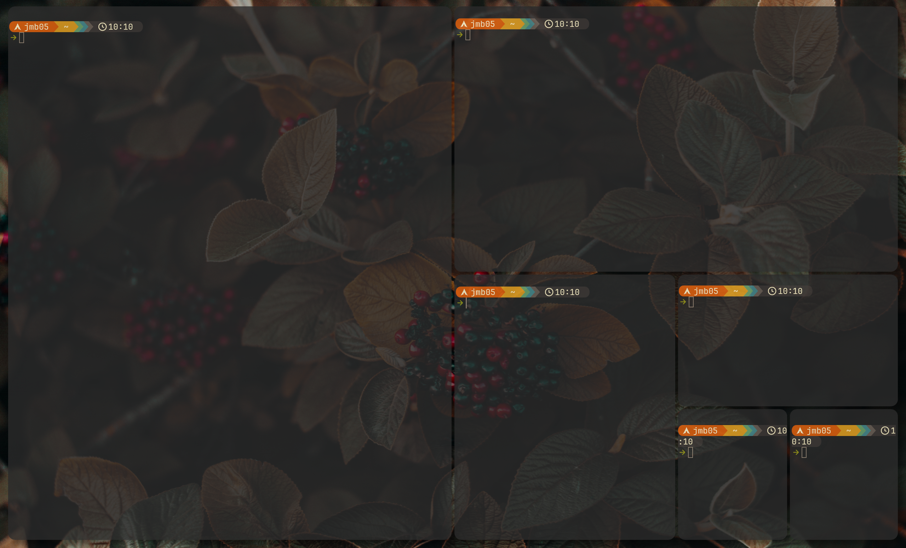

## i3-alternating-layout-rs

A program which alternates vertical and horizontal splitting
when opening windows on i3. Based on the python script
[olemartinorg/i3-alternating-layout](https://github.com/olemartinorg/i3-alternating-layout).
But written in rust.

### Building

Rust (and Cargo) need to be installed, see:
[Rust Installation Guide](https://doc.rust-lang.org/cargo/getting-started/installation.html)

then, clone the repo:
```
git clone https://github.com/jmb05/i3-alternating-layout-rs
```

and build using cargo:
```
cd i3-alternating-layout-rs
cargo build --release
```

the binary will be located at `target/release/i3-alternating-layout-rs`

### Usage
To autostart with i3 add
```
exec --no-startup-id /path/to/i3-alternating-layout-rs
```
to your i3 config.

### Screenshot

